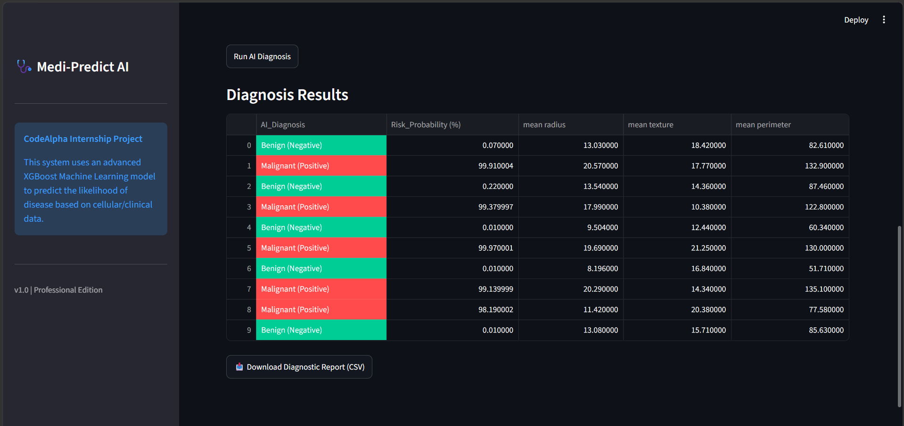
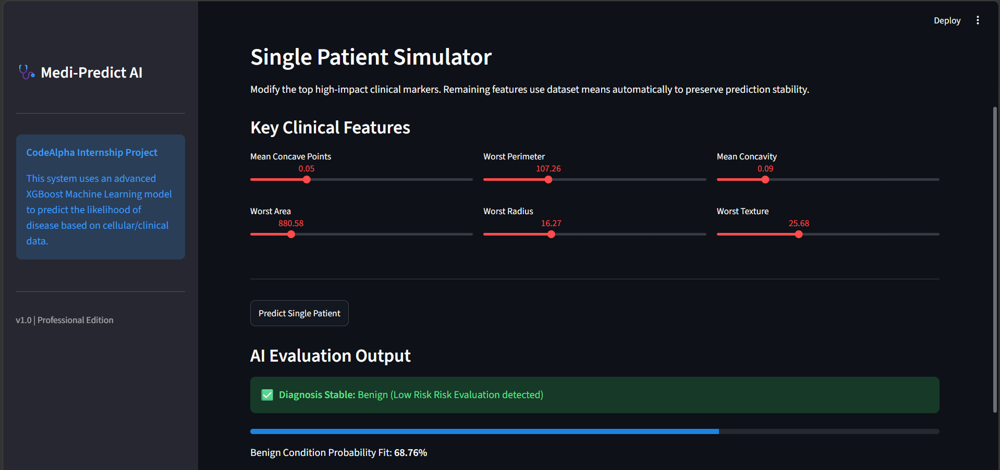
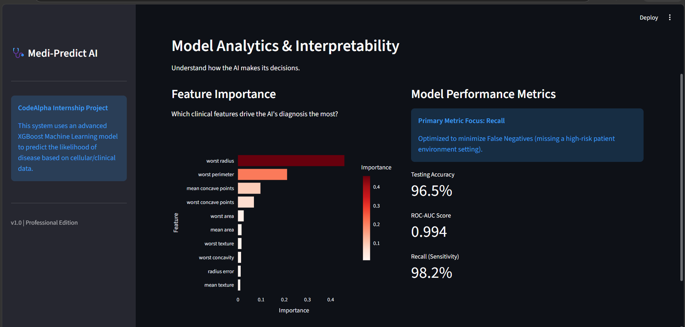

# 🩺 Medi-Predict AI

An advanced Machine Learning-powered healthcare analytics platform built using **XGBoost**, **Streamlit**, and **Scikit-Learn** for intelligent breast cancer risk prediction and clinical decision support.

---

## 🚀 Overview

Medi-Predict AI is a professional medical diagnostic dashboard that predicts whether a patient's condition is likely **Benign** or **Malignant** using clinical and cellular measurements from the Breast Cancer Wisconsin Diagnostic Dataset.

The system provides:

- 📁 Batch Patient Diagnosis from CSV files
- 🔬 Single Patient Risk Simulation
- 📊 AI Model Interpretability & Feature Importance Analysis
- 📈 Performance Analytics Dashboard
- 📥 Downloadable Diagnostic Reports

This project demonstrates the practical application of Machine Learning in healthcare analytics and disease prediction.

---

## Screenshots

## 📁 Batch Prediction Dashboard



## 🧪 Single Patient Simulator



## 📊 Model Analytics & Interpretability



---

## ✨ Features

### 📁 Batch Prediction Module
- Upload patient datasets in CSV format
- Analyze multiple patient records simultaneously
- Generate disease predictions instantly
- Export diagnostic reports as CSV

### 🔬 Single Patient Simulator
- Interactive sliders for clinical feature adjustment
- Real-time risk prediction
- Benign/Malignant classification
- Probability-based confidence score

### 📊 Model Analytics & Explainability
- Feature Importance Visualization
- AI Decision Transparency
- Clinical Marker Analysis
- Model Interpretability Dashboard

### 📈 Performance Metrics
- Accuracy: **96.5%**
- ROC-AUC Score: **0.994**
- Recall (Sensitivity): **98.2%**

The model is optimized to minimize false negatives, making it highly effective for healthcare screening applications.

---

## 🧠 Machine Learning Model

### Algorithm Used
**XGBoost Classifier**

### Why XGBoost?
- High predictive accuracy
- Excellent performance on structured medical datasets
- Fast inference speed
- Strong generalization capability
- Built-in feature importance extraction

---

## 📂 Dataset

### Breast Cancer Wisconsin Diagnostic Dataset

Dataset Characteristics:

- Total Samples: 569
- Clinical Features: 30
- Classes:
  - Malignant (Cancerous)
  - Benign (Non-Cancerous)

Dataset Source:
Scikit-Learn Built-in Breast Cancer Dataset

---

## 🏗️ System Workflow

```text
Patient Data
      │
      ▼
Data Preprocessing
      │
      ▼
XGBoost Prediction Model
      │
 ┌────┴────┐
 ▼         ▼
Batch    Single
Analysis Patient Test
 │         │
 └────┬────┘
      ▼
Risk Assessment
      │
      ▼
Visualization Dashboard
      │
      ▼
Diagnostic Report
```

---

## 🛠️ Technologies Used

| Technology | Purpose |
|------------|----------|
| Python | Core Development |
| Streamlit | Web Application |
| XGBoost | Machine Learning Model |
| Pandas | Data Analysis |
| NumPy | Numerical Computing |
| Scikit-Learn | Dataset & Evaluation |
| Plotly | Interactive Visualization |
| Joblib | Model Persistence |

---

## 📦 Installation

### Clone Repository

```bash
git clone https://github.com/your-username/Medi-Predict-AI.git

cd Medi-Predict-AI
```

### Install Dependencies

```bash
pip install -r requirements.txt
```

### Run Application

```bash
streamlit run CodeAlpha_MediPredict.py
```

---

## 📊 Sample Output

### Batch Prediction Results

| AI Diagnosis | Risk Probability |
|-------------|----------------|
| Benign | 0.07% |
| Malignant | 99.91% |
| Benign | 0.22% |

---

## 🎯 Learning Outcomes

This project helped in understanding:

- Machine Learning Model Deployment
- Medical Data Analysis
- Healthcare AI Applications
- Streamlit Dashboard Development
- Model Explainability Techniques
- Real-Time Prediction Systems

---

## ⚠️ Disclaimer

This project is intended for educational and research purposes only.

The predictions generated by this system should not be considered professional medical advice or used for actual medical diagnosis.

Always consult qualified healthcare professionals for medical decisions.

---

## 👨‍💻 Author

**Tamil S**

B.E Artificial Intelligence & Machine Learning (AIML)

KPR Institute of Engineering and Technology (KPRIET)

Coimbatore, Tamil Nadu, India

---

## 🏆 CodeAlpha AI Internship Project

Developed as part of the **CodeAlpha Artificial Intelligence Internship Program** to showcase practical Machine Learning applications in healthcare diagnostics.

⭐ If you found this project useful, consider giving the repository a star!
